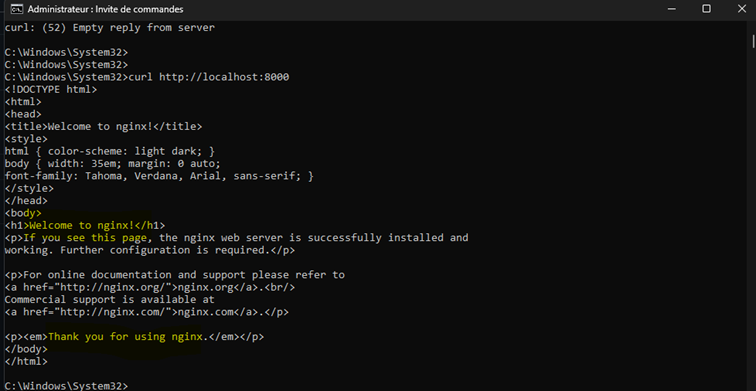

# ☸️ TP1 - Déploiement initial de MyOpenIA sur Kubernetes


> **Module :** Kubernetes | **Projet :** MyOpenIA | **Durée :** 3h30

Ce projet documente le déploiement de la plateforme **MyOpenIA** (recherche de ressources pédagogiques) sur un cluster Kubernetes local.
**Mission :** Déployer les premiers services (`gateway-api` et `agent-service`) en environnement professionnel, sans développer l'application elle-même.

---

## 🎯 Objectifs Pédagogiques
* Vérifier l'environnement Kubernetes.
* Créer un namespace dédié (isolation).
* Déployer une application via `Deployment`.
* Exposer une application via `Service`.
* Observer l'auto-guérison (*Self-healing*).

---

## 📂 Architecture des Fichiers
Le projet suit une logique de déploiement par couches dans `infra/k8s/base/` :

| Fichier | Description |
| :--- | :--- |
| `namespace.yaml` | Création de l'environnement isolé `myopenia`. |
| `gateway-api-*.yaml` | Déploiement et Service du point d'entrée (Port 80). |
| `agent-service-*.yaml` | Déploiement et Service du backend (Port 80). |

---

## 📋 Guide Technique Pas à Pas

### 1️⃣ Vérification & Création de l'environnement
Nous validons l'état du nœud et créons l'espace d'isolation logique.

<details>
<summary>💻 Voir les commandes terminal</summary>

* Vérifier le cluster :
    ```bash
    kubectl get nodes
    ```
* Créer le namespace :
    ```bash
    kubectl apply -f infra/k8s/base/namespace.yaml
    ```
* Vérifier l'activation :
    ```bash
    kubectl get namespaces
    ```
</details>


---

### 2️⃣ Déploiement des Services (Gateway & Agent)
Application des manifestes pour les deux micro-services.

<details>
<summary>💻 Voir les commandes terminal</summary>

* Appliquer la configuration complète :
    ```bash
    kubectl apply -f infra/k8s/base/
    ```
* Vérifier l'état global :
    ```bash
    kubectl get all -n myopenia
    ```
</details>


> **Analyse de l'état :**
> * **Pods :** Les 2 micro-services sont en état `Running`.
> * **Services :** IPs internes (ClusterIP) attribuées.
> * **Stabilité :** 1 réplique maintenue par service.

---

### 3️⃣ Accès à l'API (Port-Forwarding)
Les services étant internes, nous créons un tunnel pour y accéder depuis la machine hôte.

> **🛠️ Difficulté rencontrée & Solution :**
> L'image `nginx:latest` écoute nativement sur le port **80**. Nous avons dû adapter la configuration (targetPort) pour mapper le port local **8000** vers le port **80** du conteneur, au lieu des ports 8000/8080 initialement envisagés.

<details>
<summary>💻 Voir les commandes terminal</summary>

* Lancer le tunnel :
    ```bash
    kubectl port-forward svc/gateway-api 8000:80 -n myopenia
    ```
* Tester l'accès :
    ```bash
    curl http://localhost:8000
    ```
</details>



---

### 4️⃣ Test de Résilience (Auto-Guérison)
Simulation d'une panne critique en supprimant un Pod manuellement.

<details>
<summary>💻 Voir les commandes terminal</summary>

* Supprimer le pod :
    ```bash
    kubectl delete pod <nom-du-pod> -n myopenia
    ```
* Observer la réaction :
    ```bash
    kubectl get pods -n myopenia
    ```
</details>


**Résultats de l'observation :**
1.  **Le Pod est-il recréé ?** Oui, immédiatement (Age : 14s).
2.  **Pourquoi ?** Le `Deployment` a détecté un écart entre l'état désiré (1) et l'état réel (0).
3.  **Continuité :** Le `Service` redirige automatiquement le trafic vers le nouveau Pod.

---

## 🧠 Synthèse Technique (Livrable)

### Rôle des ressources
* **Namespace (`myopenia`)** : Isolation virtuelle pour éviter les conflits.
* **Deployment** : Le "cerveau" qui surveille les Pods et assure l'état désiré.
* **Service** : Interface réseau stable (IP fixe) pour des Pods éphémères.

### Ce que Kubernetes gère automatiquement
* **Self-healing :** Recréation automatique des pods supprimés ou plantés.
* **Service Discovery :** Maintien de l'accès réseau malgré le changement d'IP des Pods.

---

## 🏁 Conclusion
Ce TP a permis de valider la résilience de l'architecture MyOpenIA. L'application est capable de survivre à la défaillance d'un conteneur de manière totalement autonome. La base est prête pour l'intégration de la **persistance** et des **secrets**.

---
*Projet réalisé par Abdoul Aziz LO - Module Kubernetes*
